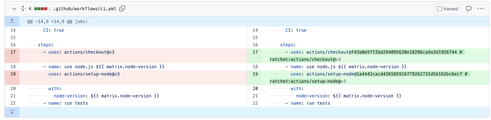

# Ratcher Dispatcher

Ratchet Dispatcher can be used to execute ratchet on target repositories, allowing for central deployment.
This tool will trigger the `ratchet pin` command on the target repositories. Meaning it will pin the version of every action that is used in a workflow file. After that, it will create a pull request with the changes.

## Why?

It is considered a best practice to pin the version of the actions used in a workflow file. This will prevent bad actors from injecting malicious code into your workflow by overwriting a tag/version of an action. This tool will help you to automate this process across multiple repositories.

## Tools required

- [Ratchet](https://github.com/sethvargo/ratchet)

## Usage

```bash
ratchet-dispatcher --repos <comma separated list of repositories(org/repo format)> --branch <branch>
```

`--branch` is optional and defaults to `automated-ratchet-dispatcher-pin`.

*To authenticate with GitHub, you need to set the `GITHUB_TOKEN` environment variable.*

## Example

You can also provide the token via an environment variable.

```bash
GITHUB_TOKEN=token-here ratchet-dispatcher --repos "org/repo1,org/repo2" --branch main-ratchet-target
```

### Example output



## Questions

### Will refs not make it difficult for maintainers to maintain the workflow files?

While I understand that managing refs is difficult for maintainers, it is a necessary evil. Ratchet makes it easier as it will also place a comment in the workflow file to add a more human-readable version of the action. This will make it easier for maintainers to understand what the action does.
It is also recommend to let an external tool like Dependabot manage the refs for you. This way you can be sure that you are always using the latest version of the action. Dependabot is able to update the refs for you, so you don't have to worry about it.

### How do I retrieve the list of repositories?

You can use the GitHub API to retrieve the list of repositories. You can use the following command to retrieve the list of repositories:

```bash
gh api /orgs/:org/repos --paginate | jq -r '.[].full_name'
```

This will return a list of repositories in the format `org/repo`. You can use this list as input for the `--repos` flag.

## License

This project is licensed under the MIT License - see the [LICENSE](LICENSE) file for details.

## Acknowledgments

- [Ratchet](https://github.com/sethvargo/ratchet) - This project would not be possible without Ratchet. Major props to Seth Vargo for creating this tool. Thanks!
